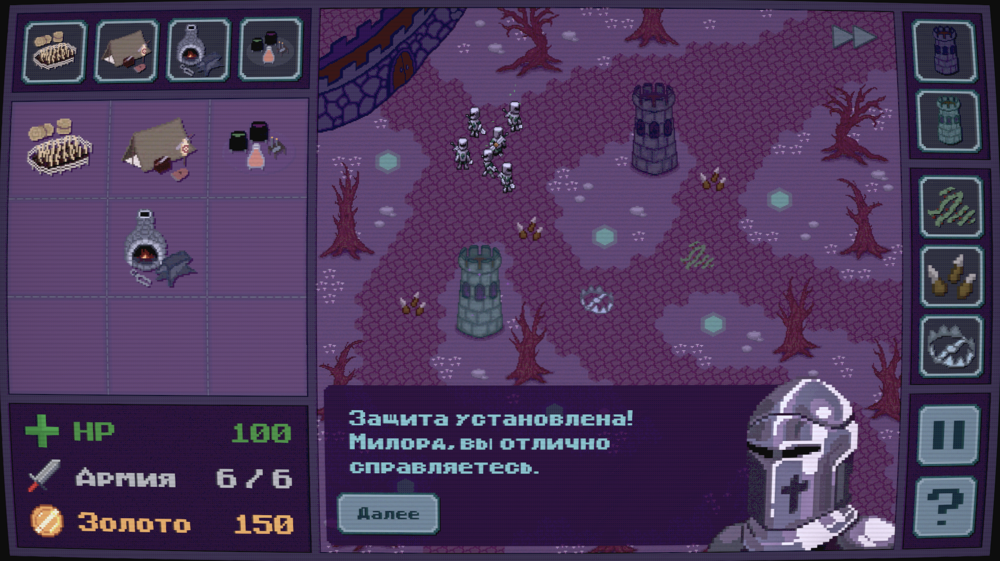
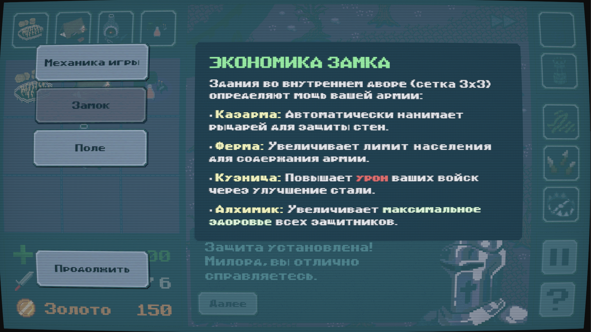
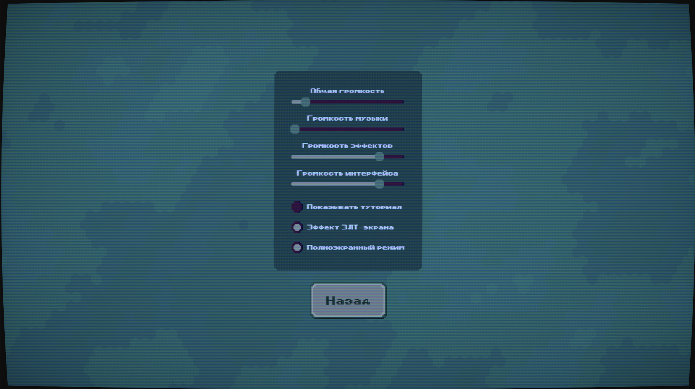
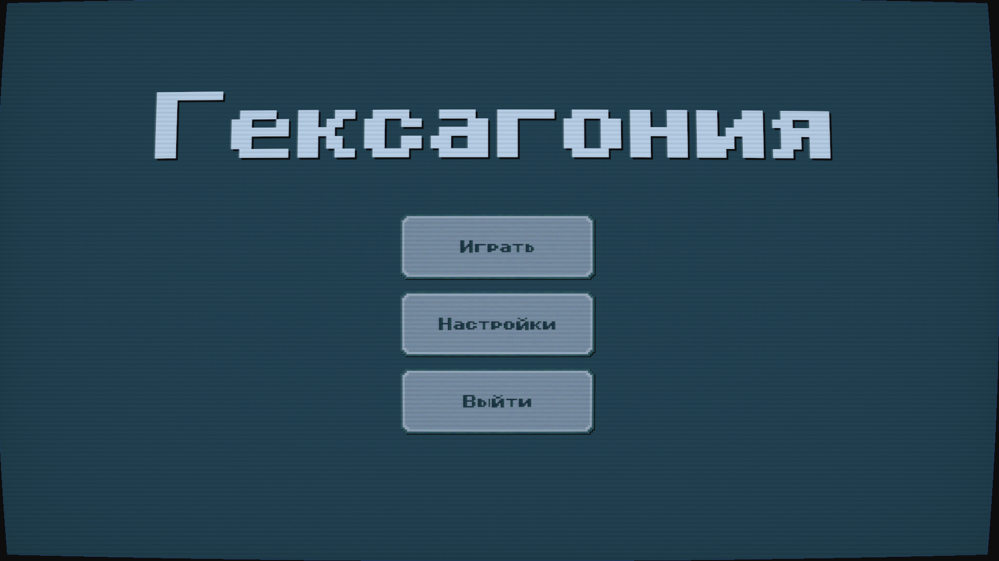

### Гексагония

**Гексагония** — это гибрид Tower Defense и симулятора управления замком, где вам предстоит защищать сердце королевства
от монстров. Чтобы победить, сочетайте развитие внутри стен крепости с расстановкой ловушек и
башен на поле боя.

---

## Особенности игры

### Двойная система строительства

* **Экономика Замка:** Внутренний двор представляет собой сетку **3x3**. Здесь вы строите Казармы, Фермы, Кузницы и
  Алхимические лаборатории, которые дают пассивные бонусы вашей армии.
* **Оборона Поля:** Внешний мир состоит из гексагональной сетки. Размещайте башни в специальные слоты и устанавливайте
  ловушки, чтобы остановить врага.

### Тактическое разнообразие

* **Башни:**
    - Волшебники, наносящие урон по площади снарядами, которые могут преследовать свою цель
    - Лучники, стреляющие по нескольким целям. Быстрые и дальнобойные
* **Ловушки:**
    - Замедляющая врагов лоза
    - Капканы с большим мгновенным уроном
    - Шипы с небольшим периодическим уроном
* **Прогрессия:** Улучшайте урон и здоровье войск через постройки в замке.

### Технические решения

* **Продвинутый UI:** Плавные переходы, контекстные подсказки и отзывчивые drag & drop элементы.
* **Динамический курсор:** Пиксель-арт курсор, меняющий форму при наведении и захвате предметов.
* **Система данных:** Все настройки зданий, башен, ловушек, монстров, рыцарей и звуков построена на `ScriptableObjects`,
  что позволяет легко
  расширять или изменять контент.
* **Хранение поля:** Игровое поле хранится в json файле, благодаря чему можно легко добавить новые уровни.
* **Адаптивный интерфейс:** Игра доступна на мониторах с соотношением как 16:9, так и 16:10.
* **Разделение ответственности:** В коде разделена логика, UI и визуал, благодаря чему дальнейшая разработка не
  представляет проблемы.

---

## Управление

| Клавиша | Действие                                                     |
|:--------|:-------------------------------------------------------------|
| `ЛКМ`   | Перетаскивание предметов, покупка, взаимодействие c кнопками |
| `Space` | Ускорение времени                                            |
| `Esc`   | Пауза / Закрыть активное меню                                |

---

## Стек

* **Движок:** Unity 6.4
* **Язык:** C#

---

## Как играть

1. **Начало:** Игра находится в режиме ожидания, пока вы не разместите первую постройку, ловушку или башню.
2. **Экономика:** Постройте **Ферму** для повышения лимита рыцарей и **Бараки** для их найма.
3. **Оборона:** Используйте заработанное золото, чтобы поставить **Башню** или **Ловушку** для защиты периметра.
4. **Улучшения:** Также можно построить в замке **Кузницу** для увеличения урона рыцарей или **Алхимика**, который сделает рыцарей более живучими.
5. **Ускорение:** Если игра кажется слишком медленной, нажмите `Пробел`, чтобы ускорить её.
6. **Победа:** Переживите все волны монстров, не дав им разрушить замок.

---

## Скриншоты

    
    
    
  

---

## Сборка и запуск

1. Клонируйте репозиторий.
2. Откройте проект в Unity.
3. Соберите билд для Windows/Mac.

---

## Авторы

* Куранова Юлия
* Захаров Ярослав
